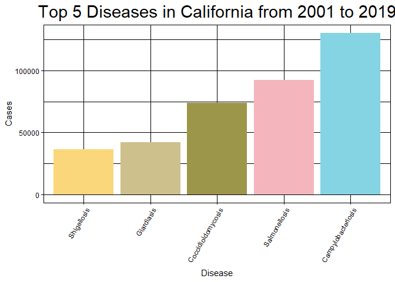
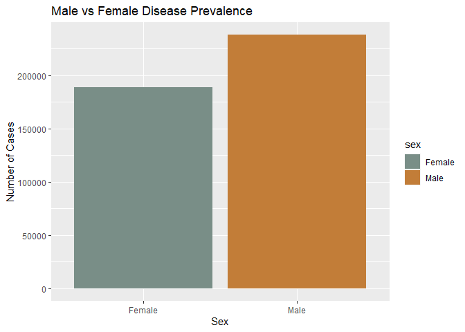
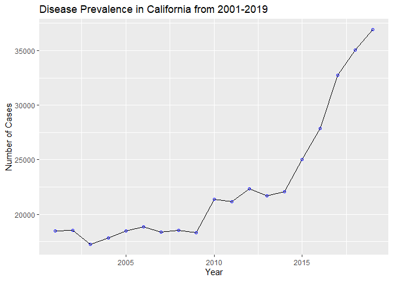
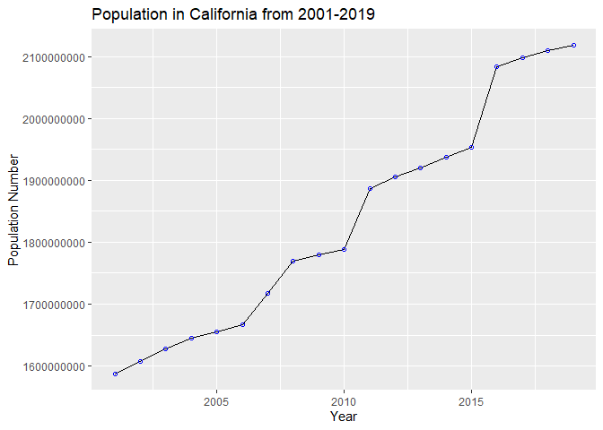
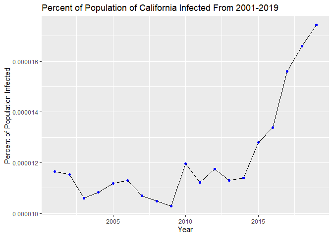

## Load Libraries 

```r
#install.packages('highcharter')
```


```r
library(tidyverse)
library(janitor)
library(svglite)
library(shiny)
library(shinydashboard)
library(paletteer)
library(highcharter)
options(scipen=999)
```

## Load the Data

```r
disease <- readr::read_csv("Data/infectious-diseases-by-county-year-and-sex 2.csv")
```

```
## 
## -- Column specification --------------------------------------------------------
## cols(
##   Disease = col_character(),
##   County = col_character(),
##   Year = col_double(),
##   Sex = col_character(),
##   Cases = col_double(),
##   Population = col_double(),
##   Rate = col_character(),
##   Lower_95__CI = col_double(),
##   Upper_95__CI = col_double()
## )
```

```r
disease
```

```
## # A tibble: 164,433 x 9
##    Disease  County   Year Sex   Cases Population Rate  Lower_95__CI Upper_95__CI
##    <chr>    <chr>   <dbl> <chr> <dbl>      <dbl> <chr>        <dbl>        <dbl>
##  1 Amebias~ Alameda  2001 Fema~     7     746596 0.93~        0.377        1.93 
##  2 Amebias~ Alameda  2001 Male      9     718968 1.25~        0.572        2.38 
##  3 Amebias~ Alameda  2001 Total    16    1465564 1.09~        0.624        1.77 
##  4 Amebias~ Alameda  2002 Fema~     4     747987 0.53~        0.146        1.37 
##  5 Amebias~ Alameda  2002 Male      5     720481 0.69~        0.225        1.62 
##  6 Amebias~ Alameda  2002 Total     9    1468468 0.61~        0.28         1.16 
##  7 Amebias~ Alameda  2003 Fema~     1     747441 0.13~        0.003        0.745
##  8 Amebias~ Alameda  2003 Male      5     719746 0.69~        0.226        1.62 
##  9 Amebias~ Alameda  2003 Total     7    1467187 0.47~        0.192        0.983
## 10 Amebias~ Alameda  2004 Fema~     3     746723 0.40~        0.083        1.17 
## # ... with 164,423 more rows
```

## Tidy Names of Data

```r
disease_tidy <- janitor::clean_names(disease)
names(disease_tidy)
```

```
## [1] "disease"     "county"      "year"        "sex"         "cases"      
## [6] "population"  "rate"        "lower_95_ci" "upper_95_ci"
```

## Remove data we will not use

```r
disease_data <- disease_tidy %>% 
  select(disease, county, year, sex, cases, population)
disease_data
```

```
## # A tibble: 164,433 x 6
##    disease   county   year sex    cases population
##    <chr>     <chr>   <dbl> <chr>  <dbl>      <dbl>
##  1 Amebiasis Alameda  2001 Female     7     746596
##  2 Amebiasis Alameda  2001 Male       9     718968
##  3 Amebiasis Alameda  2001 Total     16    1465564
##  4 Amebiasis Alameda  2002 Female     4     747987
##  5 Amebiasis Alameda  2002 Male       5     720481
##  6 Amebiasis Alameda  2002 Total      9    1468468
##  7 Amebiasis Alameda  2003 Female     1     747441
##  8 Amebiasis Alameda  2003 Male       5     719746
##  9 Amebiasis Alameda  2003 Total      7    1467187
## 10 Amebiasis Alameda  2004 Female     3     746723
## # ... with 164,423 more rows
```

## Summary of Data


```r
skimr::skim(disease_data)
```


Table: Data summary

|                         |             |
|:------------------------|:------------|
|Name                     |disease_data |
|Number of rows           |164433       |
|Number of columns        |6            |
|_______________________  |             |
|Column type frequency:   |             |
|character                |3            |
|numeric                  |3            |
|________________________ |             |
|Group variables          |None         |


**Variable type: character**

|skim_variable | n_missing| complete_rate| min| max| empty| n_unique| whitespace|
|:-------------|---------:|-------------:|---:|---:|-----:|--------:|----------:|
|disease       |         0|             1|   7|  77|     0|       53|          0|
|county        |         0|             1|   4|  15|     0|       59|          0|
|sex           |         0|             1|   4|   6|     0|        3|          0|


**Variable type: numeric**

|skim_variable | n_missing| complete_rate|      mean|         sd|   p0|   p25|    p50|    p75|     p100|hist                                     |
|:-------------|---------:|-------------:|---------:|----------:|----:|-----:|------:|------:|--------:|:----------------------------------------|
|year          |         0|          1.00|   2010.28|       5.49| 2001|  2006|   2010|   2015|     2019|▇▇▆▇▇ |
|cases         |      4120|          0.97|     10.65|     142.95|    0|     0|      0|      0|    10001|▇▁▁▁▁ |
|population    |         0|          1.00| 848040.32| 3527101.31|  563| 29245| 125234| 422487| 39959095|▇▁▁▁▁ |


```r
dim(disease_data)
```

```
## [1] 164433      6
```


```r
naniar::miss_var_summary(disease_data)
```

```
## # A tibble: 6 x 3
##   variable   n_miss pct_miss
##   <chr>       <int>    <dbl>
## 1 cases        4120     2.51
## 2 disease         0     0   
## 3 county          0     0   
## 4 year            0     0   
## 5 sex             0     0   
## 6 population      0     0
```

## General Data Analysis

We must first convert cases and population to numeric.

```r
disease_data$cases <- as.numeric(disease_data$cases) 
disease_data$population <- as.numeric(disease_data$population) 
```

1. Which disease is most prevalent throughout all of California?

```r
disease_data %>%
  filter(county!="California", sex=="Total") %>%
  group_by(disease) %>%
  summarise(total_cases = sum(cases)) %>%
  arrange(desc(total_cases))
```

```
## # A tibble: 53 x 2
##    disease                                          total_cases
##    <chr>                                                  <dbl>
##  1 Campylobacteriosis                                    130249
##  2 Salmonellosis                                          92173
##  3 Coccidioidomycosis                                     73798
##  4 Giardiasis                                             41974
##  5 Shigellosis                                            36605
##  6 Shiga toxin-producing E. coli (STEC) without HUS       13686
##  7 Cryptosporidiosis                                       7220
##  8 Amebiasis                                               6939
##  9 Legionellosis                                           4774
## 10 Vibrio Infection (non-Cholera)                          3058
## # ... with 43 more rows
```

```r
disease_data %>%
  filter(county!="California", disease == "Campylobacteriosis", sex == "Total") %>%
  summarise(total_cases = sum(cases))
```

```
## # A tibble: 1 x 1
##   total_cases
##         <dbl>
## 1      130249
```
*Campylobacteriosis is the most prevalent disease in California. It is an infection caused by consuming any raw poultry or meat.*

2. What are the top 5 most prevalent diseases in California?


```r
top_5_diseases <- disease_data %>%
  filter(county!="California", sex=="Total") %>%
  group_by(disease) %>%
  summarise(total_cases = sum(cases)) %>%
  top_n(5) %>%
  arrange(desc(total_cases))
```

```
## Selecting by total_cases
```

```r
top_5_diseases
```

```
## # A tibble: 5 x 2
##   disease            total_cases
##   <chr>                    <dbl>
## 1 Campylobacteriosis      130249
## 2 Salmonellosis            92173
## 3 Coccidioidomycosis       73798
## 4 Giardiasis               41974
## 5 Shigellosis              36605
```


```r
palette <- paletteer_d("wesanderson::Moonrise3")

top_5_diseases %>%
  ggplot(aes(x=reorder(disease, total_cases), y= total_cases))+
  geom_col(fill = palette)+
  theme_linedraw()+
  theme(axis.text.x = element_text(angle=60, hjust = 1), plot.title = element_text(size = rel(2), hjust = .5)) +
  labs(title = "Top 5 Diseases in California from 2001 to 2019",
       x = "Disease",
       y= "Cases")
```

<!-- -->
*We can see the top 5 diseases are Campylobacteriosis, Salmonellosis, Coccidioidomycosis, Giardiasis, Shigellosis.*

Visualizing as a Pie Chart!

```r
top5_df <- data.frame(x = c(0, 1, 2 ,3 ,4),
                 y = c(130249, 92173, 73798, 41974, 36605),
                 name = as.factor(c('Campylobacteriosis', 'Salmonellosis', 'Coccidioidomycosis', 'Giardiasis', 'Shigellosis')))

hc <-  top5_df %>%
  hchart('pie', hcaes(x = name, y = y), name = 'Relative California Disease Cases')

hc
```

```{=html}
<div id="htmlwidget-368de7dda04debf2322d" style="width:100%;height:500px;" class="highchart html-widget"></div>
<script type="application/json" data-for="htmlwidget-368de7dda04debf2322d">{"x":{"hc_opts":{"chart":{"reflow":true},"title":{"text":null},"yAxis":{"title":{"text":"y"},"type":"linear"},"credits":{"enabled":false},"exporting":{"enabled":false},"boost":{"enabled":false},"plotOptions":{"series":{"label":{"enabled":false},"turboThreshold":0,"showInLegend":false},"treemap":{"layoutAlgorithm":"squarified"},"scatter":{"marker":{"symbol":"circle"}}},"series":[{"group":"group","data":[{"y":130249,"name":"Campylobacteriosis"},{"y":92173,"name":"Salmonellosis"},{"y":73798,"name":"Coccidioidomycosis"},{"y":41974,"name":"Giardiasis"},{"y":36605,"name":"Shigellosis"}],"type":"pie","name":"Relative California Disease Cases"}],"xAxis":{"type":"category","title":{"text":"name"},"categories":null}},"theme":{"chart":{"backgroundColor":"transparent"},"colors":["#7cb5ec","#434348","#90ed7d","#f7a35c","#8085e9","#f15c80","#e4d354","#2b908f","#f45b5b","#91e8e1"]},"conf_opts":{"global":{"Date":null,"VMLRadialGradientURL":"http =//code.highcharts.com/list(version)/gfx/vml-radial-gradient.png","canvasToolsURL":"http =//code.highcharts.com/list(version)/modules/canvas-tools.js","getTimezoneOffset":null,"timezoneOffset":0,"useUTC":true},"lang":{"contextButtonTitle":"Chart context menu","decimalPoint":".","downloadJPEG":"Download JPEG image","downloadPDF":"Download PDF document","downloadPNG":"Download PNG image","downloadSVG":"Download SVG vector image","drillUpText":"Back to {series.name}","invalidDate":null,"loading":"Loading...","months":["January","February","March","April","May","June","July","August","September","October","November","December"],"noData":"No data to display","numericSymbols":["k","M","G","T","P","E"],"printChart":"Print chart","resetZoom":"Reset zoom","resetZoomTitle":"Reset zoom level 1:1","shortMonths":["Jan","Feb","Mar","Apr","May","Jun","Jul","Aug","Sep","Oct","Nov","Dec"],"thousandsSep":" ","weekdays":["Sunday","Monday","Tuesday","Wednesday","Thursday","Friday","Saturday"]}},"type":"chart","fonts":[],"debug":false},"evals":[],"jsHooks":[]}</script>
```


3. What county has the most total disease cases?

```r
disease_data %>%
  filter(county!="California", sex=="Total") %>%
  group_by(county) %>%
  summarise(sum_cases = sum(cases)) %>%
  arrange(desc(sum_cases))
```

```
## # A tibble: 58 x 2
##    county        sum_cases
##    <chr>             <dbl>
##  1 Los Angeles       89165
##  2 Kern              38682
##  3 San Diego         38002
##  4 Orange            23544
##  5 Santa Clara       22873
##  6 San Francisco     20776
##  7 Alameda           20167
##  8 Fresno            18597
##  9 Riverside         12448
## 10 Sacramento        11875
## # ... with 48 more rows
```

```r
disease_data %>%
  filter(county == "Los Angeles", sex == "Total") %>%
  summarise(total_cases = sum(cases))
```

```
## # A tibble: 1 x 1
##   total_cases
##         <dbl>
## 1       89165
```
*Los Angeles county has the highest number of cases: 89,165.*

4. County with least total disease cases?

```r
disease_data %>%
  filter(county!="California", sex=="Total") %>%
  group_by(county) %>%
  summarise(sum_cases = sum(cases)) %>%
  arrange(sum_cases)
```

```
## # A tibble: 58 x 2
##    county    sum_cases
##    <chr>         <dbl>
##  1 Alpine            2
##  2 Sierra           38
##  3 Modoc            47
##  4 Trinity          74
##  5 Mariposa        122
##  6 Del Norte       133
##  7 Plumas          152
##  8 Lassen          158
##  9 Mono            167
## 10 Colusa          181
## # ... with 48 more rows
```

```r
disease_data %>%
  filter(county == "Alpine", sex == "Total") %>%
  summarise(total_cases = sum(cases))
```

```
## # A tibble: 1 x 1
##   total_cases
##         <dbl>
## 1           2
```
*Alpine county only has 2 total cases!*

Looking at the smallest and greatest populations

```r
pop_highest <- disease_data %>%
  filter(county!="California", sex=="Total") %>%
  group_by(county) %>%
  summarise(mean_population_lowest = mean(population)) %>%
  arrange(mean_population_lowest) %>% 
  head(n=1)
pop_highest
```

```
## # A tibble: 1 x 2
##   county mean_population_lowest
##   <chr>                   <dbl>
## 1 Alpine                  1190.
```

```r
pop_lowest <- disease_data %>%
  filter(county!="California", sex=="Total") %>%
  group_by(county) %>%
  summarise(mean_population_highest = mean(population)) %>%
  arrange(mean_population_highest) %>% 
  tail(n=1)
pop_lowest
```

```
## # A tibble: 1 x 2
##   county      mean_population_highest
##   <chr>                         <dbl>
## 1 Los Angeles                9959978.
```
*The county that has the highest case numbers also has the highest population throughout the years that data was collected. The county with the lowest case numbers also has the lowest average population throughout the years that data was collected.* 

5. Does population affect case numbers for all of the counties? Not just LA and Alpine?


```r
cases_overall <- disease_data %>%
  select(county, population, sex, cases) %>%
  filter(county!="California", sex=="Total") %>%
  group_by(county) %>%
  summarise(total_cases = sum(cases)) %>%
  arrange(desc(total_cases))
cases_overall
```

```
## # A tibble: 58 x 2
##    county        total_cases
##    <chr>               <dbl>
##  1 Los Angeles         89165
##  2 Kern                38682
##  3 San Diego           38002
##  4 Orange              23544
##  5 Santa Clara         22873
##  6 San Francisco       20776
##  7 Alameda             20167
##  8 Fresno              18597
##  9 Riverside           12448
## 10 Sacramento          11875
## # ... with 48 more rows
```

```r
disease_data %>%
  ggplot(aes(x= population, y= cases))+
  geom_point(size = .1) +
  theme(plot.title = element_text(hjust = .5)) + theme_get() +
  labs(title = "Population vs Cases from 2001 to 2019",
       x = "Population",
       y= "Cases")
```

```
## Warning: Removed 4120 rows containing missing values (geom_point).
```

<!-- -->
*It seems like when there is a higher population there is a higher number of cases and vice versa, which is expected. More on this later!!*

6. Are males or females more impacted by disease in California

```r
disease_data %>%
  filter(county!="California") %>%
  group_by(sex) %>%
  summarise(sum_cases = sum(cases, na.rm=T)) %>%
  arrange(desc(sum_cases))
```

```
## # A tibble: 3 x 2
##   sex    sum_cases
##   <chr>      <dbl>
## 1 Total     431015
## 2 Male      234194
## 3 Female    185247
```


```r
palette2 <- paletteer_d("wesanderson::Moonrise2")
```


```r
disease_data %>% 
  filter(county=="California", sex != "Total") %>%
  group_by(sex) %>% 
  summarise(sum_cases = sum(cases, na.rm=T)) %>%
  ggplot(aes(x=sex, y=sum_cases, fill = sex)) +
  geom_col()+
  scale_fill_manual(values = palette2) +
    labs(title="Male vs Female Disease Prevalence",
       x="Sex",
       y="Number of Cases")
```

<!-- -->
*Males are more effected than females.* 

7. How has infectious disease prevalence changed over time in California?

```r
disease_data %>% 
  filter(county=="California", sex=="Total") %>%
  group_by(year) %>% 
  summarise(sum_cases = sum(cases)) %>% 
  ggplot(aes(x=year, y=sum_cases))+
  geom_line()+
  geom_point(shape=1, color="Blue")+
  labs(title="Disease Prevalence in California from 2001-2019",
       x="Year",
       y="Number of Cases")
```

<!-- -->

*Increased! But has the population has also increased?*


```r
disease_data %>% 
  filter(county=="California", sex=="Total") %>%
  group_by(year) %>% 
  summarise(sum_cases = sum(population)) %>% 
  ggplot(aes(x=year, y=sum_cases))+
  geom_line()+
  geom_point(shape=1, color="Blue")+
  labs(title="Population in California from 2001-2019",
       x="Year",
       y="Population Number")
```

<!-- -->

*Yes, so we cannot say increase in disease is due to disease factors alone, there are also way more people! We can take the proportion of disease to the population over time to see if there was an actual disease incidence increase.*


```r
scaling_pop_cases <- disease_data %>%
  filter(county!="California", sex=="Total") %>%
  group_by(year) %>%
  summarise(sum_population = sum(population),
            sum_cases = sum(cases)) %>%
  mutate(scaling_cases_and_population = sum_cases/sum_population) 
scaling_pop_cases
```

```
## # A tibble: 19 x 4
##     year sum_population sum_cases scaling_cases_and_population
##  * <dbl>          <dbl>     <dbl>                        <dbl>
##  1  2001     1587586132     18498                    0.0000117
##  2  2002     1607161340     18535                    0.0000115
##  3  2003     1627890688     17271                    0.0000106
##  4  2004     1644627190     17817                    0.0000108
##  5  2005     1655336772     18510                    0.0000112
##  6  2006     1667353812     18839                    0.0000113
##  7  2007     1717968863     18382                    0.0000107
##  8  2008     1769098656     18545                    0.0000105
##  9  2009     1779705792     18324                    0.0000103
## 10  2010     1788189936     21386                    0.0000120
## 11  2011     1886477200     21167                    0.0000112
## 12  2012     1905057750     22367                    0.0000117
## 13  2013     1920502650     21722                    0.0000113
## 14  2014     1937129750     22097                    0.0000114
## 15  2015     1952769150     25004                    0.0000128
## 16  2016     2083357708     27877                    0.0000134
## 17  2017     2098302489     32730                    0.0000156
## 18  2018     2110342605     35038                    0.0000166
## 19  2019     2117832035     36906                    0.0000174
```


```r
scaling_pop_cases %>% 
  ggplot(aes(x=year,y=scaling_cases_and_population))+
  geom_line() + geom_point(color="Blue")+
  labs(title="Percent of Population of California Infected From 2001-2019",
       x="Year",
       y="Percent of Population Infected")
```

<!-- -->
*We see that the percent of the population infected over time increases, so we can say that the increase in disease prevalence isn't just because there are more people to infect.*

## Shiny App


```r
dat <- disease_data %>% filter(sex=="Total") %>% select(!sex)

ui <- dashboardPage(skin="purple",
  dashboardHeader(title = "Disease Abundance"),
  dashboardSidebar(disable = T),
  dashboardBody(
  fluidRow(
  box(title = "Plot Options", width = 3,
  selectInput("fill", "Select Disease", choices=unique(disease_data$disease)),
                hr(),
      helpText("The data represent cases with an estimated illness onset date from 2001 through the last year indicated from California Confidential Morbidity Reports and/or Laboratory Reports")
  ),
  
  box(title = "What is the Disease Incidence per California County?", width = 9,
  plotOutput("plot", width = "1200px", height = "500px", click="plot_click"),
  verbatimTextOutput("info")
  ),
  
  box(title="What Disease is the Most Prevalent in California from 2001-2019?", width=7,
      plotOutput("plot2", width="1800px", height="600px")
    )
  ) 
  )
  ) 

server <- function(input, output, session) { 
  
  output$plot <- renderPlot({
  disease_data %>% 
  filter(county!="California", disease==input$fill) %>% 
  ggplot(aes_string(x = "county", y="cases", fill="county")) + 
  geom_col()+
  theme_light(base_size = 18)+
  labs (x="County", y="Cases", fill="Disease")+
  theme(axis.text.x = element_text(angle = 60, hjust = 1), legend.position="none")
  })
  
  output$plot2 <-renderPlot({
    disease_data %>%
  filter(sex == "Total", county != "California") %>%
  ggplot(aes(x=reorder(disease, cases), y= log10(cases)))+
  geom_col(fill="purple") +
      theme_light(base_size=18)+
      labs (x="Disease", y="Log10 Cases", fill="Cases")+
  theme(axis.text.y = element_text(size=12), legend.position="none") + coord_flip()
  })

  
   output$info <- renderText({
    paste0("x=", input$plot_click$x, "\ny=", input$plot_click$y)
})
  session$onSessionEnded(stopApp)
  
} 
shinyApp(ui, server)
```

`<div style="width: 100% ; height: 400px ; text-align: center; box-sizing: border-box; -moz-box-sizing: border-box; -webkit-box-sizing: border-box;" class="muted well">Shiny applications not supported in static R Markdown documents</div>`{=html}
